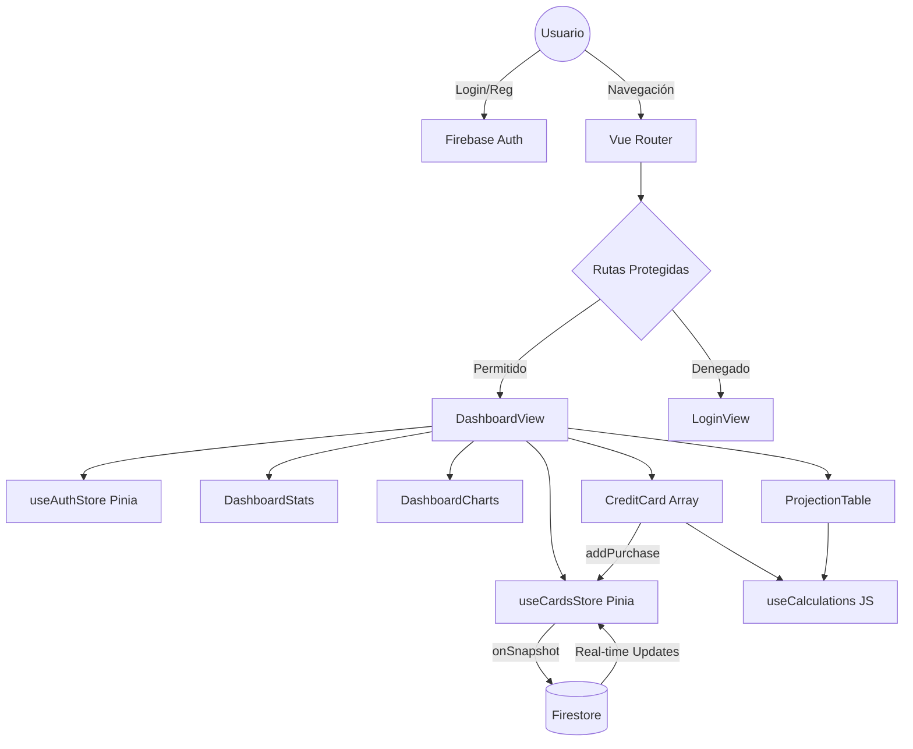

# Contexto Completo del Proyecto: Gestor de Tarjetas (Vue + Firebase + PWA)

## 1. DESCRIPCIÓN GENERAL DEL PROYECTO

El **Gestor de Tarjetas** es una Aplicación Web de Página Única (SPA) moderna, diseñada para permitir a los usuarios llevar un control exhaustivo y preciso de sus tarjetas de crédito, gastos, fechas de corte, fechas de pago y proyecciones financieras a corto y mediano plazo.

* **Objetivo:** Facilitar la salud financiera del usuario mediante una herramienta que consolide las deudas, advierta sobre fechas de pago próximas, y permita proyectar la deuda en meses futuros considerando compras a Meses Sin Intereses (MSI) y cargos fijos/recurrentes.
* **Arquitectura:** Arquitectura basada en componentes reactivos (Vue 3) con estado global descentralizado (Pinia) y Backend-as-a-Service (BaaS) utilizando Firebase para la autenticación y base de datos NoSQL en tiempo real (Firestore). Todo empaquetado mediante Vite.
* **Propósito:** Reemplazar un sistema monolítico tradicional (PHP/HTML nativo) por una solución moderna, desacoplada, reactiva y mantenible.
* **Flujo general:** El usuario se autentica (Login/Registro). Al entrar, un listener de sesión recupera el UID. El Store de tarjetas se suscribe a una colección privada en Firestore para ese UID. La UI reacciona a los datos, permitiendo visualizar un Dashboard, agregar tarjetas y registrar compras.
* **Dispositivos soportados:** Gracias a TailwindCSS, la aplicación es "mobile-first" y completamente responsiva, adaptándose a móviles, tablets y monitores de escritorio.
* **Sincronización Multi-dispositivo:** Firestore opera con `onSnapshot`, lo que significa que si el usuario tiene la app abierta en su celular y en su PC, cualquier cambio en un dispositivo se refleja de manera instantánea (en milisegundos) en el otro sin necesidad de recargar la página.
* **Objetivo PWA:** Convertir la aplicación web en una aplicación instalable de forma nativa en Android, iOS y Desktop, con capacidades de cacheo local de recursos estáticos a través de Workbox y un Service Worker, logrando tiempos de carga casi nulos en visitas subsecuentes.

---

## 2. TECNOLOGÍAS UTILIZADAS

* **Vue 3 (Composition API & `<script setup>`):** Framework de interfaz de usuario. Se usa en su versión más moderna, descartando el Options API en favor de Composition API, lo que permite un código más limpio, reutilizable (composables) y mejor inferencia de tipos.
* **Vite:** Herramienta de compilación (bundler) de próxima generación. Sustituye a Webpack/Vue CLI. Se usa para ofrecer un entorno de desarrollo extremadamente rápido (HMR) y construcciones de producción altamente optimizadas usando Rollup.
* **Pinia:** Gestor de estado oficial de Vue. Sustituye a Vuex. Se usa para mantener el estado global del usuario (`useAuthStore`) y de las tarjetas (`useCardsStore`), permitiendo a cualquier componente acceder a los datos sin prop-drilling.
* **Vue Router:** Enrutador oficial. Permite la navegación sin recarga de página (SPA). Controla las vistas principales (`/`, `/login`, `/registro`) e implementa Navigation Guards para proteger rutas privadas.
* **TailwindCSS:** Framework CSS utility-first. Se usa para estilizar la aplicación directamente en el markup de forma rápida, coherente y manteniendo un sistema de diseño predecible.
* **Firebase Auth:** Servicio de autenticación. Gestiona el registro, inicio de sesión y persistencia de la sesión del usuario de forma segura, manejando tokens JWT por debajo.
* **Firestore:** Base de datos NoSQL alojada en la nube. Almacena las tarjetas y compras del usuario. Se estructura en documentos y colecciones con reglas de seguridad basadas en el UID del usuario.
* **GitHub Pages:** Plataforma de hosting de archivos estáticos. Sirve el `dist/` generado por Vite.
* **vite-plugin-pwa:** Plugin de Vite para configurar rápidamente el Service Worker y el `manifest.webmanifest`.
* **Workbox:** Librería de Google integrada en `vite-plugin-pwa` que gestiona las estrategias de caché (CacheFirst, NetworkFirst) para hacer la app resiliente a malas conexiones y funcionar como PWA.

---

## 3. ESTRUCTURA COMPLETA DEL PROYECTO

```text
tarjetas/
├── .env                    # Variables de entorno locales (NO se sube a GitHub)
├── .env.example            # Plantilla de variables (SÍ se sube a GitHub)
├── .gitignore              # Excluye .env, node_modules, dist
├── index.html              # Punto de entrada HTML
├── package.json            # Dependencias y scripts
├── vite.config.js          # Configuración de Vite, base URL y PWA plugin
├── README.md               # Documentación de entrada del proyecto
├── docs/
│   └── contexto_completo_proyecto.md  # Documentación técnica completa
├── .github/
│   └── workflows/
│       └── deploy.yml      # CI/CD automático a GitHub Pages
├── public/
│   ├── favicon.svg
│   ├── icons.svg
│   └── img/                # Iconos PWA (pwa-192x192.png, pwa-512x512.png)
└── src/
    ├── main.js             # Entrada JS (monta Vue, Pinia, Router, registra PWA SW)
    ├── App.vue             # Componente raíz (RouterView)
    ├── assets/
    │   └── index.css       # Estilos globales y directivas Tailwind
    ├── router/
    │   └── index.js        # Definición de rutas (Hash Mode) y Route Guards
    ├── services/
    │   └── firebase.js     # Inicialización de Firebase App, Auth y Firestore
    ├── stores/
    │   ├── useAuthStore.js # Estado de sesión, login, logout, registro
    │   └── useCardsStore.js# Estado de tarjetas, CRUD Firestore, Sync
    ├── composables/
    │   └── useCalculations.js # Lógica matemática pura para fechas y proyecciones
    ├── views/
    │   ├── DashboardView.vue  # Vista principal privada
    │   ├── LoginView.vue      # Vista de inicio de sesión
    │   └── RegisterView.vue   # Vista de registro
    └── components/
        ├── cards/
        │   └── CreditCard.vue     # Componente visual de una tarjeta individual
        ├── dashboard/
        │   ├── DashboardStats.vue   # Tarjetas de resumen (Límite, Deuda global)
        │   ├── DashboardCharts.vue  # Gráficos de Dona y Línea (Chart.js)
        │   ├── DashboardFilters.vue # Búsqueda y ordenamiento
        │   └── ProjectionTable.vue  # Tabla de proyecciones a 12 meses
        └── modals/
            └── AddCardModal.vue   # Modal para registrar nueva tarjeta
```

### Carpeta `docs/`
La carpeta `docs/` fue creada para centralizar la documentación técnica del proyecto dentro del propio repositorio. Su propósito principal es:
* **Persistencia:** El archivo `contexto_completo_proyecto.md` sirve como contexto persistente para futuras sesiones con agentes de IA (Antigravity), evitando la necesidad de re-explicar la arquitectura en cada conversación.
* **Accesibilidad:** Al vivir dentro del repositorio, cualquier desarrollador o agente puede acceder a la documentación directamente con un `git clone`.
* **Versionado:** Al estar bajo control de versiones, cada cambio en la documentación queda registrado en el historial de commits.

---

## 4. FUNCIONALIDAD COMPLETA

### Login y Registro
* **Autenticación:** Usa `signInWithEmailAndPassword` y `createUserWithEmailAndPassword` de Firebase Auth.
* **Persistencia:** Firebase maneja la persistencia por defecto en `indexedDB` / `localStorage`. En `main.js` o en el Route Guard se espera a que `onAuthStateChanged` resuelva antes de renderizar la app o redirigir, evitando que el usuario sea pateado al login al recargar la página.
* **Rutas protegidas:** `Vue Router` utiliza un `beforeEach` que verifica si `to.meta.requiresAuth` es `true`. Si el usuario no está logueado, lo redirige a `/login`. Si el usuario está logueado e intenta ir a `/login`, lo redirige a `/`.

### Dashboard
* **Estadísticas:** Calcula de forma global iterando sobre todas las tarjetas para obtener el Límite Total, Deuda Total y Deuda a Pagar este Mes.
* **Cálculos y Gráficos:** Usa `vue-chartjs`. Muestra el uso de crédito vs el disponible (Doughnut) y la evolución proyectada de la deuda (Line).
* **Filtros:** Permite buscar tarjetas por nombre o por concepto de compra, y ordenarlas por deuda o nombre.

### Tarjetas
* **Creación:** Se solicita Nombre, Límite, Día de Corte y Días para Pagar.
* **Sincronización:** Cada tarjeta se guarda en `users/{UID}/cards/{CardID}`. Se inyecta un UUID en el frontend.

### Compras
* **Registro:** Se registran dentro del array `purchases` del documento de la tarjeta.
* **Tipos de Compra:**
  1. **Directa/Normal:** Afecta la deuda inmediatamente y se debe pagar según la fecha de corte que abarque la compra.
  2. **Meses Sin Intereses (MSI):** El sistema divide el `amount / months`. El límite de la tarjeta se ve afectado por el total de forma inmediata, pero la "Deuda a pagar este mes" solo suma la parcialidad correspondiente si la fecha de pago de esa mensualidad cae en el ciclo actual.
  3. **Recurrente (Fijo):** El cargo se proyecta hacia todos los meses futuros sin finiquitarse.

### Lógica de Proyección y Fechas (`useCalculations.js`)
* **Fechas Seguras:** Evita el problema del día 31 en meses de 30 días o febrero, ajustando las fechas correctamente usando lógica modular.
* **Proyecciones:** Genera un arreglo de 12 meses futuros a partir del mes actual. Itera sobre cada compra de cada tarjeta, evalúa en qué fechas de pago caerán las cuotas (usando los MSI) y suma el monto a la columna del mes/año correspondiente.

---

## 5. FIREBASE

### Configuración
Inicializado en `src/services/firebase.js` usando variables de entorno `import.meta.env.VITE_FIREBASE_*`.

### Estructura de Colecciones
Base de datos jerárquica:
`users` (Collection) -> `{UID}` (Document) -> `cards` (Collection) -> `{CardID}` (Document)
Cada documento de tarjeta contiene:
* `name`, `limit`, `cutoffDay`, `paymentDays`, `usedBalance`, `order`.
* `purchases` (Array de objetos con: `id`, `description`, `amount`, `category`, `date`, `isMSI`, `months`, `isRecurring`).

### Sincronización en Tiempo Real
En `useCardsStore`, la función `fetchCards` establece un listener usando `onSnapshot(query(collection(db, 'users/UID/cards'))))`.
Cuando se detecta un cambio en Firestore (desde cualquier origen), el callback actualiza el arreglo reactivo `cards.value`. Esto hace que Vue re-renderice automáticamente la UI.
`addDoc` / `setDoc`: Para escribir datos.
`updateDoc`: Para modificar balance o agregar compras al array.
`deleteDoc`: Para eliminar tarjetas.

### Reglas de Firestore (Recomendadas)
```javascript
rules_version = '2';
service cloud.firestore {
  match /databases/{database}/documents {
    match /users/{userId} {
      allow read, write: if request.auth != null && request.auth.uid == userId;
      match /cards/{cardId} {
        allow read, write: if request.auth != null && request.auth.uid == userId;
      }
    }
  }
}
```

---

## 6. FLUJO DE DATOS Y REACTIVIDAD

1. **Firestore** lanza evento `onSnapshot` por un cambio de dato.
2. **Pinia (`useCardsStore.js`)** recibe el arreglo de documentos, lo mapea y muta la variable `const cards = ref([])`.
3. **Pinia Computed:** Los getters como `globalStats` recalculan automáticamente los totales basados en el nuevo arreglo de `cards`.
4. **Vue Components:** `DashboardView.vue` que está observando `cardsStore.cards` detecta el cambio, pasa los datos a su prop `computed` `filteredCards`.
5. **Render:** La UI se actualiza de manera eficiente vía Virtual DOM. Todo esto ocurre en milisegundos.

---

## 7. STORES (PINIA)

### `useAuthStore`
* **Estados:** `user`, `loading`, `error`.
* **Acciones:** `initAuth()` (crea una promesa alrededor de `onAuthStateChanged`), `login()`, `register()`, `logout()`.

### `useCardsStore`
* **Estados:** `cards`, `loading`.
* **Acciones:** `fetchCards()` (inicia snapshot), `stopSync()`, `addCard()`, `updateCard()`, `deleteCard()`, `reorderCards()`.
* **Computed:** `globalStats` (reduce todas las tarjetas a `{totalLimit, totalDebt, totalEsteMes}`).

---

## 8. COMPONENTES IMPORTANTES

* **`DashboardView.vue`:** Vista orquestadora. Inyecta los stores. Mantiene el estado de UI local (`searchQuery`, `sortBy`). Pasa los datos procesados a los subcomponentes. Monta el lifecycle (`onMounted` para sync, `onUnmounted` para detener sync).
* **`CreditCard.vue`:** Componente de la tarjeta. Muestra el progreso visual del límite. Contiene su propio formulario para agregar nuevas compras. Lanza la acción de `updateCard` del store para guardar nuevas compras mutando su propio estado.
* **`DashboardStats.vue`:** Muestra las tarjetas grandes de resumen. Consume directamente `store.globalStats`.
* **`DashboardCharts.vue`:** Contenedor de `vue-chartjs`. Formatea los datos de `store` y `useCalculations` en el formato estricto de `{labels, datasets}` que pide Chart.js.
* **`ProjectionTable.vue`:** Recibe los datos de proyección de 12 meses de `useCalculations` y renderiza una tabla scrolleable horizontalmente.

---

## 9. PWA (PROGRESSIVE WEB APP)

Configurada a través de `vite-plugin-pwa` en `vite.config.js`.

### Actualización de configuración PWA
Para que el proyecto cumpliera con todos los estándares modernos de instalación, se realizaron las siguientes correcciones de compatibilidad integrales:
* **Iconos físicos y Maskable:** Se usan imágenes de alta resolución derivadas de un máster de 4096x4096, exportadas como `public/img/pwa-192x192-v2.png` y `public/img/pwa-512x512-v2.png`. Estos incluyen `purpose: 'any maskable'` en el manifest, lo que permite a Android adaptar el icono a cualquier forma (círculo, lágrima, etc.) garantizando una integración visual perfecta sin bordes blancos no deseados. Adicionalmente, se incluye un `apple-touch-icon.png` (180x180) para compatibilidad nativa con "Añadir a pantalla de inicio" en iOS.
* **Estrategia anti-caché:** Se utiliza el sufijo `-v2` en los nombres de archivo de los iconos para invalidar forzosamente cachés antiguas y asegurar que dispositivos con la app ya instalada actualicen visualmente su launcher.
* **Rutas relativas:** Se corrigieron los problemas de rutas absolutas (`/img/pwa.png` -> `img/pwa-192x192-v2.png`) en `vite.config.js` asegurando compatibilidad completa con la opción `base: '/Tarjetas/'` generada por Vite.
* **Propiedades finales del manifest:** El manifest incluye las siguientes propiedades rigurosas:
  ```js
  display: 'standalone' // Oculta la barra de navegación del sistema para comportarse como app nativa.
  start_url: '/Tarjetas/#/' // Forzado por la configuración del Hash Router para evitar fallos de inicialización.
  scope: '/Tarjetas/' // Delimita explícitamente en qué directorio el Service Worker actuará.
  ```

### Integración del Service Worker
El registro del Service Worker en Producción se maneja explícitamente en `src/main.js`:
```js
import { registerSW } from 'virtual:pwa-register'

registerSW({
  immediate: true
})
```
* **Auto actualización:** Al llamar a `registerSW({ immediate: true })`, la app y el Service Worker toman el control de inmediato. Cuando un nuevo build se despliegue en GitHub Pages, el plugin descargará los assets silenciosamente y los actualizará.
* **Cacheo:** A través de Workbox (`globPatterns: ['**/*.{js,css,html,ico,png,svg}']`), se cachean absolutamente todos los recursos críticos.
* **Funcionamiento Offline:** Si el usuario no tiene conexión a internet en futuras visitas, el Service Worker intercepta la petición, devuelve la aplicación estática en tiempo cero y Firebase permite visualizaciones y colas de escritura sin conexión hasta que vuelva el internet.

### Compatibilidad móvil
* **Android Instalable:** La aplicación ya posee todos los requerimientos heurísticos de Lighthouse y **puede instalarse nativamente** sin problemas en sistemas Android y Escritorio.
* **Compatibilidad de Navegadores:** `Samsung Internet` y navegadores afines detectarán al 100% y ofrecerán el badge PWA en la barra de URL. 
* **Chrome Android:** Si Chrome en Android es algo restrictivo y decide no lanzar el "banner flotante" inmediatamente (debido a sus propias métricas de usuario), la instalación manual puede forzarse sin fallos desde: **Menú (tres puntos) → "Instalar aplicación" o "Agregar a pantalla principal"**.

### Buenas prácticas visuales para Iconos PWA
Para mantener la calidad del branding en futuras actualizaciones, se deben seguir estas reglas al generar nuevos iconos:
* **Usar imagen máster de alta resolución:** Utilizar siempre un PNG base de al menos `4096x4096`. Esto garantiza un escalado perfecto sin pérdida de nitidez al generar las variantes de `192px` y `512px`.
* **Mantener relación 1:1:** El asset debe ser perfectamente cuadrado.
* **Padding interno adecuado:** Dejar espacio (margen) entre los bordes de la imagen y el elemento principal del logo. Esto es crucial para que los iconos *maskable* funcionen bien cuando Android recorta la imagen en forma de círculo o gota.
* **Evitar texto pequeño:** Los iconos se muestran en tamaños tan reducidos como `48x48` en algunos launchers. El texto pequeño se volverá ilegible.
* **Diseño simple y reconocible:** Priorizar formas sólidas y contrastes altos que destaquen tanto en modo claro como en modo oscuro.
* **Propósito Maskable:** Siempre mantener `purpose: 'any maskable'` en el manifest para delegar el control de la forma final al sistema operativo del usuario.

---

## 10. GITHUB PAGES Y DESPLIEGUE

* **vite.config.js:** Se incluyó `base: '/Tarjetas/'` para que los assets carguen correctamente desde el subdirectorio de GitHub Pages (ej. `https://Ozvaldo12.github.io/Tarjetas/`).
* **Acción de Despliegue:** Se puede utilizar un Workflow de GitHub Actions `.github/workflows/deploy.yml` que:
  1. Clona el repositorio.
  2. Ejecuta `npm install`.
  3. Ejecuta `npm run build`.
  4. Sube la carpeta `dist/` a GitHub Pages vía Actions.

### Corrección de GitHub Pages + Vue Router
Durante el desarrollo se encontró un defecto grave de **404 File Not Found** al recargar o entrar de forma directa a rutas secundarias (ej. `https://ozvaldo12.github.io/Tarjetas/login`).

* **El Problema:** GitHub Pages es un servidor estático absoluto. No posee la habilidad de redireccionar peticiones limpias (`/login`) a un `index.html` del lado del servidor (no hay backend propio ni archivos de configuración de Apache/Nginx soportados para esto nativamente).
* **Efectos:** Esto rompía recargas de página, validaciones automáticas de Service Workers, e inhabilitaba por completo las evaluaciones de instalación PWA en Chrome.
* **La Solución (Migración):** Se migró el motor de historial del Router.
  De:
  ```js
  createWebHistory()
  ```
  A:
  ```js
  createWebHashHistory()
  ```
* **Impacto Positivo:** El nuevo formato de las rutas incluye un "hash" (`/Tarjetas/#/login`). Para GitHub Pages, cualquier petición siempre aterriza en `/Tarjetas/index.html` de manera segura, evitando por completo el 404. El enrutamiento hacia el login o dashboard sucede en el lado del cliente (Navegador) al leer el hash. Esto solucionó permanentemente las recargas rotas y solidificó las validaciones del Service Worker PWA para el entorno host.

---

## 11. VARIABLES DE ENTORNO Y SEGURIDAD

### Arquitectura de archivos de entorno
El proyecto maneja tres archivos relacionados con variables de entorno, cada uno con un propósito distinto:

| Archivo | ¿Se sube a GitHub? | Propósito |
|---------|--------------------|-----------|
| `.env` | ❌ **NUNCA** | Contiene las credenciales reales de Firebase. Solo existe localmente. |
| `.env.example` | ✅ Sí | Plantilla con la estructura de las variables (sin valores reales) para que otros desarrolladores sepan qué configurar. |
| `.gitignore` | ✅ Sí | Contiene la regla que excluye `.env`, `.env.local` y `.env.*.local` del tracking de git. |

### Cómo Vite inyecta las variables
Vite utiliza el mecanismo `import.meta.env` para exponer variables de entorno al código del cliente. **Solo las variables que comienzan con el prefijo `VITE_` son accesibles** desde el código fuente. En `src/services/firebase.js`:
```js
const firebaseConfig = {
  apiKey: import.meta.env.VITE_FIREBASE_API_KEY,
  authDomain: import.meta.env.VITE_FIREBASE_AUTH_DOMAIN,
  projectId: import.meta.env.VITE_FIREBASE_PROJECT_ID,
  storageBucket: import.meta.env.VITE_FIREBASE_STORAGE_BUCKET,
  messagingSenderId: import.meta.env.VITE_FIREBASE_MESSAGING_SENDER_ID,
  appId: import.meta.env.VITE_FIREBASE_APP_ID
}
```
Durante `npm run build`, Vite reemplaza estáticamente cada `import.meta.env.VITE_*` por su valor literal en el bundle de producción. Si la variable no existe, se inyecta `undefined`, lo cual provoca un crash silencioso de Firebase.

### Plantilla `.env.example`
```env
VITE_FIREBASE_API_KEY=tu-api-key
VITE_FIREBASE_AUTH_DOMAIN=tu-proyecto.firebaseapp.com
VITE_FIREBASE_PROJECT_ID=tu-proyecto
VITE_FIREBASE_STORAGE_BUCKET=tu-proyecto.appspot.com
VITE_FIREBASE_MESSAGING_SENDER_ID=tu-sender-id
VITE_FIREBASE_APP_ID=tu-app-id
```

### GitHub Actions y GitHub Secrets
Al no existir `.env` en el repositorio remoto, el pipeline de CI/CD (GitHub Actions) necesita otra fuente para las variables. Se configuraron **GitHub Repository Secrets** que se inyectan como variables de entorno en el step de build del workflow:
```yaml
# .github/workflows/deploy.yml
- name: Build project
  run: npm run build
  env:
    VITE_FIREBASE_API_KEY: ${{ secrets.VITE_FIREBASE_API_KEY }}
    VITE_FIREBASE_AUTH_DOMAIN: ${{ secrets.VITE_FIREBASE_AUTH_DOMAIN }}
    VITE_FIREBASE_PROJECT_ID: ${{ secrets.VITE_FIREBASE_PROJECT_ID }}
    VITE_FIREBASE_STORAGE_BUCKET: ${{ secrets.VITE_FIREBASE_STORAGE_BUCKET }}
    VITE_FIREBASE_MESSAGING_SENDER_ID: ${{ secrets.VITE_FIREBASE_MESSAGING_SENDER_ID }}
    VITE_FIREBASE_APP_ID: ${{ secrets.VITE_FIREBASE_APP_ID }}
```
Estos secrets se configuran en: **GitHub.com → Repositorio → Settings → Secrets and variables → Actions**.

### Riesgos de exponer credenciales Firebase
Aunque Firebase utiliza reglas de seguridad del lado del servidor (Firestore Rules, Auth Rules), exponer las credenciales públicamente permite que actores maliciosos:
* Creen cuentas masivas en tu proyecto Firebase Auth (abuse de cuota).
* Envíen peticiones arbitrarias contra tu proyecto, consumiendo tu plan gratuito o de pago.
* Intenten explotar configuraciones de reglas incorrectas.

---

## 12. ERRORES ENCONTRADOS Y LECCIONES DE DEBUGGING

Esta sección detalla los problemas críticos enfrentados durante la migración y cómo fueron resueltos para referencia futura.

1. **Error: Missing or insufficient permissions en Firestore**
   * **Causa:** Reglas de seguridad cerradas (`allow read, write: if false;`) o el usuario intentaba leer una ruta a la que no tenía permiso.
   * **Solución:** Actualizar las reglas de Firestore en la consola de Firebase para permitir el acceso condicionado a la autenticación del usuario. Validar en `fetchCards` que `authStore.user.uid` exista antes de hacer la query.

2. **Error Silencioso que rompía el render: `ReferenceError: ref is not defined` en `DashboardView`**
   * **Causa:** Durante la refactorización hacia Composition API, en `CreditCard.vue` se utilizó `const newPurchase = ref({...})` pero el desarrollador olvidó hacer `import { ref } from 'vue'`.
   * **Efecto de Cascada:** Como `CreditCard.vue` es hijo de `DashboardView.vue`, cuando Vue intentaba montar el componente padre, instanciaba los hijos. Al fallar el setup del hijo por un error de sintaxis/referencia, Vue abortaba completamente el renderizado del árbol. Esto dejaba la pantalla sin tarjetas sin una alerta clara en la interfaz, pero arrojaba el error en la consola del navegador.
   * **Solución:** Se analizó el archivo `CreditCard.vue` y se incluyó el import.

3. **Chart.js Filler Plugin Missing**
   * **Causa:** Los gráficos de línea con `fill: true` requerían el registro explícito del plugin `Filler`.
   * **Solución:** Importar `Filler` desde `chart.js` y agregarlo a `ChartJS.register(...)` en `DashboardCharts.vue`.

4. **GitHub Pages devolvía 404 para assets**
   * **Causa:** Vite asume que la app corre en la raíz de un dominio (`/`). En GitHub Pages, corre en un subdirectorio (`/Tarjetas/`).
   * **Solución:** Modificar `vite.config.js` agregando `base: '/Tarjetas/'`.

5. **Pantalla blanca tras eliminar `.env` del tracking de Git**
   * **Causa raíz:** Se ejecutó `git rm --cached .env` para proteger las credenciales Firebase. Esto eliminó correctamente el archivo del repositorio remoto, pero GitHub Actions (que clona el repo para hacer el build) dejó de encontrar las variables `VITE_FIREBASE_*`. Vite compiló el bundle con todas las variables como `undefined`.
   * **Efecto en cadena:** `initializeApp()` de Firebase recibió `apiKey: undefined` → Firebase crasheó silenciosamente al inicializar → `useAuthStore` no pudo resolver `onAuthStateChanged` → el Route Guard redirigía al login infinitamente o el render abortaba → **pantalla blanca completa** en producción.
   * **Diagnóstico:** Se verificó que `.env` seguía existiendo localmente (el build local funcionaba). Se identificó que el problema era exclusivo del pipeline remoto de GitHub Actions que ya no tenía acceso al archivo.
   * **Solución:** Se configuraron **GitHub Repository Secrets** con las 6 variables Firebase y se modificó `.github/workflows/deploy.yml` para inyectarlas como `env:` en el step de build. Se disparó un rebuild con un commit vacío y el deploy completó exitosamente.

---

## 13. GUÍA DE DEBUGGING FUTURO

* **DevTools de Vue:** Instalar extensión oficial de Chrome/Firefox "Vue.js devtools". Permite inspeccionar el árbol de componentes, visualizar props en tiempo real y ver el estado de los stores de Pinia.
* **Verificar Firestore:** Para confirmar si la base de datos funciona o si el problema es frontend, registrar datos en la interfaz y validar directamente en la consola web de Firebase -> Firestore Database si los documentos mutan.
* **Manejo de Errores de Render:** Si un `v-for` no se pinta o la página se queda "trabada", abrir SIEMPRE la consola del navegador (`F12`). Los errores en el hook `setup()` abortan silenciosamente el template render.
* **Logs Útiles:** Si el sync falla, colocar logs en `onSnapshot` y en `onMounted`. En caso de dudas, verificar el log de red (Network) para descartar fallas de conexión.

### Problemas comunes GitHub Pages + PWA
Si se experimentan problemas inusuales con la PWA o el Host, verificar estos puntos:
* **404 en rutas SPA:** Asegúrate de no haber vuelto a configurar el modo de historial en `createWebHistory()`. Mantén `createWebHashHistory()`.
* **Manifest no detectado / Iconos sin cargar:** Revisa que el prefijo del `base` no haya sido alterado en `vite.config.js`. Las rutas de las imágenes en los arrays deben ser relativas (`img/pwa.png`), no absolutas.
* **Service Worker fuera de scope:** Verifica que la propiedad `scope` siga apuntando al directorio raíz del proyecto real en tu host (e.g. `/Tarjetas/`).
* **Caché antigua persistente (Actualizaciones no reflejadas):** Los Service Workers son muy agresivos. Si hiciste deploy y ves una versión anterior, abre DevTools (F12) -> Application -> Storage -> `Clear site data` y recarga (F5) para forzar la bajada del nuevo Service Worker.
* **Chrome Android sin banner de instalación:** Es normal. Ocurre si faltan los propósitos `purpose: "any maskable"` en los iconos (ya configurado) o simplemente porque el sistema decide retener la notificación. Úsalo instalando desde los puntos del menú.

---

## 14. ARQUITECTURA FINAL DEL SISTEMA



---

## 15. MEJORAS FUTURAS SUGERIDAS

1. **Soporte Offline Avanzado para Firebase:** Activar explicitamente `enableIndexedDbPersistence(db)` para que Firestore pueda escribir offline y enviar los cambios cuando se recupere la red.
2. **Exportación a PDF/Excel:** Generar reportes mensuales de proyecciones mediante librerías como `jspdf` o `sheetjs`.
3. **Notificaciones Push Web:** Implementar notificaciones Push (vía Firebase Cloud Messaging + Service Workers) para alertar 2 días antes de la "Fecha de Pago".
4. **Biometría (WebAuthn):** Integrar Passkeys para que en móviles el usuario pueda iniciar sesión con huella dactilar/Face ID.
5. **Multimoneda:** Añadir opciones en la creación de la tarjeta para administrar gastos en USD, EUR y convertirlos a la moneda base.

---

## 16. ESTADO ACTUAL DEL PROYECTO

✅ **PWA funcional**
✅ **Iconos PWA profesionales actualizados (Máster 4096x4096)**
✅ **Soporte maskable icons para integración visual Android**
✅ **Caché visual controlada correctamente (-v2)**
✅ **Branding visual actualizado**
✅ **Instalable en Android/Desktop/iOS**
✅ **Routing compatible con GitHub Pages**
✅ **Variables de entorno restauradas**
✅ **Firebase operativo nuevamente**
✅ **Protección de credenciales implementada (GitHub Secrets)**
✅ **Documentación centralizada en `docs/`**
✅ **README.md profesional con referencia a docs**
✅ **Service Worker funcionando**
✅ **Actualizaciones automáticas PWA funcionando**
✅ **Firebase sincronizado multi-dispositivo**
✅ **CI/CD automatizado vía GitHub Actions**

---

## 17. OBJETIVO FINAL ALCANZADO

El proyecto pasó de ser una arquitectura antigua, monolítica y acoplada a un sistema modular, altamente escalable y asíncrono. El comportamiento original se ha preservado de manera idéntica desde el punto de vista funcional, pero tecnológicamente ahora permite despliegues PWA rápidos, tolerancias a fallos y una experiencia de usuario extremadamente superior (tipo aplicación de escritorio/móvil nativa) gracias al ecosistema Vue 3 y Vite. El sistema es mantenible y está listo para escalar.

---

## 18. MANTENIMIENTO Y ACTUALIZACIONES FUTURAS

Para conservar la aplicación sana a lo largo de las fases posteriores al lanzamiento, es imperativo entender el mecanismo de vida de las futuras actualizaciones.

### Flujo de despliegue de nuevas versiones
El proceso completo para actualizar la app instalada de todos tus usuarios está automatizado:
1. Realizar los cambios en local.
2. Hacer commit y subir el código base al repo: `git push origin main`.
3. GitHub Actions tomará el código, inyectará las variables Firebase desde **GitHub Secrets** e internamente ejecutará `npm run build`.
4. El Action publicará la carpeta empaquetada `/dist/` automáticamente en GitHub Pages.
5. El Service Worker de los navegadores de los usuarios detectará la actualización silenciosa, bajará la caché nueva y la app se **actualizará de forma automática** en su dispositivo sin requerir reinstalación de la PWA.

### Reglas Críticas ("No Tocar")
Existen propiedades estructurales de la app que **NO DEBEN** modificarse. Su alteración causará la rotura inmediata de la plataforma en producción:

* `base: '/Tarjetas/'`: Si se borra o cambia, todas las peticiones de red reventarán (Error 404 masivos de CSS/JS).
* **Nombre del repositorio en GitHub:** Cambiar el nombre a algo como `mis-tarjetas-vue` alteraría toda la ruta de GitHub Pages, dejando inútil la aplicación PWA ya instalada por tus clientes previos.
* `scope` y `start_url` del PWA: Modificar su comportamiento ocasionará conflictos en los clientes móviles Android que intenten montar la App en un subdominio erróneo.
* **Estructura de `public/img`**: Evitar mover los íconos (Ej. no llevarlos a `src/assets`), Vite y el webmanifest exigen que queden en el directorio raíz servido.
* **Router Hash History:** Volver a usar `createWebHistory()` matará las recargas completas y accesos URL limpios originando un Error 404 del host.
* **Modificar rutas de Firebase sin scripts de migración:** Alterar el Schema de la base de datos Firestore (e.g. cambiar `/users` por `/clientes`) desconectará y corromperá todos los datos previos almacenados.
* **GitHub Secrets:** Si se rotan las credenciales de Firebase, es obligatorio actualizar los 6 secrets en GitHub.com → Settings → Secrets para que el build no falle.

---

## 19. README.md Y DOCUMENTACIÓN TÉCNICA

* El archivo `README.md` fue modernizado para servir como punto de entrada profesional del proyecto. Contiene:
  * Descripción del proyecto y enlace a la demo en vivo.
  * Tabla de tecnologías utilizadas.
  * Instrucciones de instalación local y configuración de `.env`.
  * Explicación del flujo de deploy automático.
  * Enlace directo a `docs/contexto_completo_proyecto.md`.
  * Estructura visual del repositorio.
* Cualquier nuevo desarrollador o agente de IA puede leer el `README.md` como primer paso y luego profundizar en `docs/` para obtener el contexto técnico completo.

---

## 20. BUENAS PRÁCTICAS DE SEGURIDAD Y DESPLIEGUE

Reglas de seguridad y despliegue que deben seguirse de manera estricta:

1. **Nunca subir `.env` al repositorio.** Las credenciales Firebase deben vivir exclusivamente en el archivo local y en GitHub Secrets. El `.gitignore` ya incluye las reglas para excluirlo.
2. **Mantener `.env.example` actualizado.** Si se agregan nuevas variables de entorno, actualizar también la plantilla para que otros desarrolladores sepan qué configurar.
3. **Verificar `.gitignore` antes de cada commit.** Ejecutar `git status` y confirmar que `.env` no aparece en la lista de archivos staged.
4. **Validar el build local antes de hacer push.** Ejecutar `npm run build` localmente y verificar que no haya errores antes de disparar el pipeline de GitHub Actions.
5. **Verificar Firebase antes de publicar.** Confirmar que las reglas de Firestore estén correctamente configuradas y que `onAuthStateChanged` resuelva sin errores.
6. **No exponer secretos en logs ni en código.** No usar `console.log(import.meta.env.VITE_FIREBASE_API_KEY)` en producción.
7. **Rotar credenciales si se exponen.** Si las credenciales Firebase se filtraron en algún commit público, rotarlas inmediatamente desde la consola de Firebase y actualizar los GitHub Secrets.
8. **Revisar los GitHub Actions después de cada push.** Entrar a la pestaña Actions del repositorio y confirmar que el deploy terminó con estado `success` (✅).
